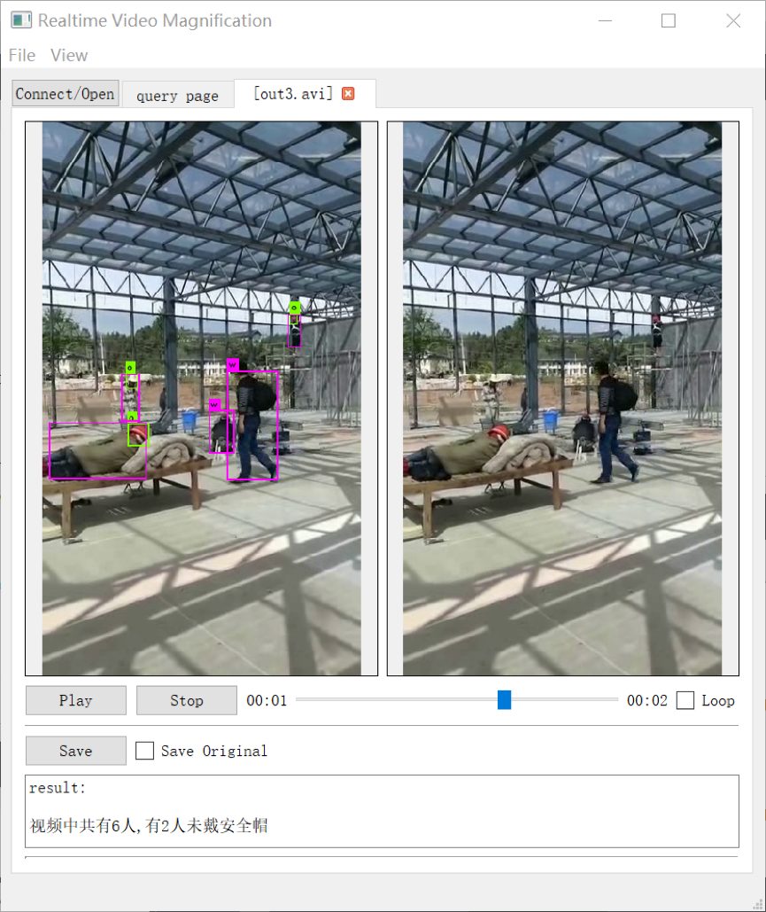
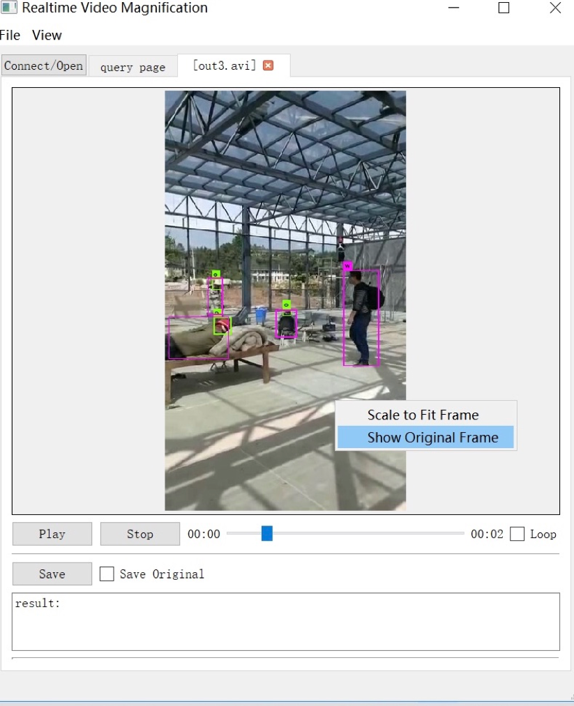
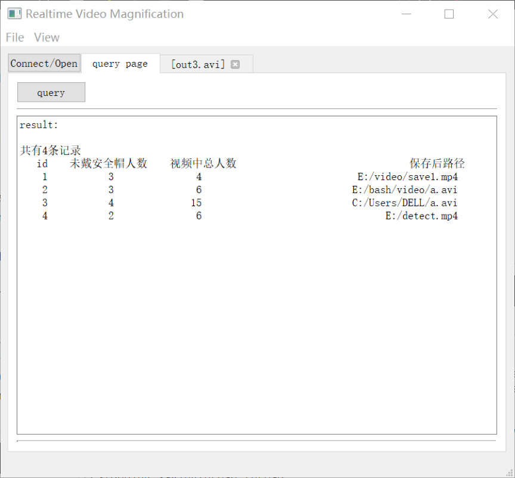
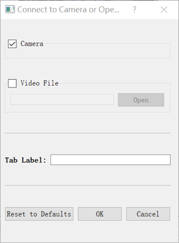
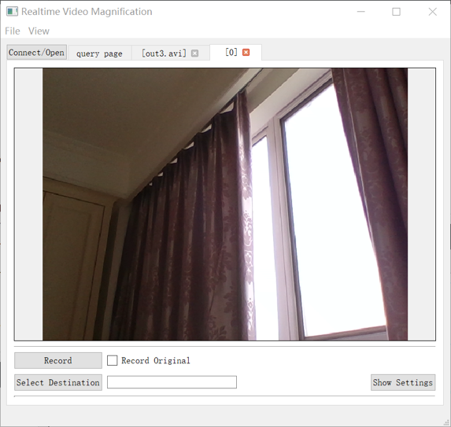
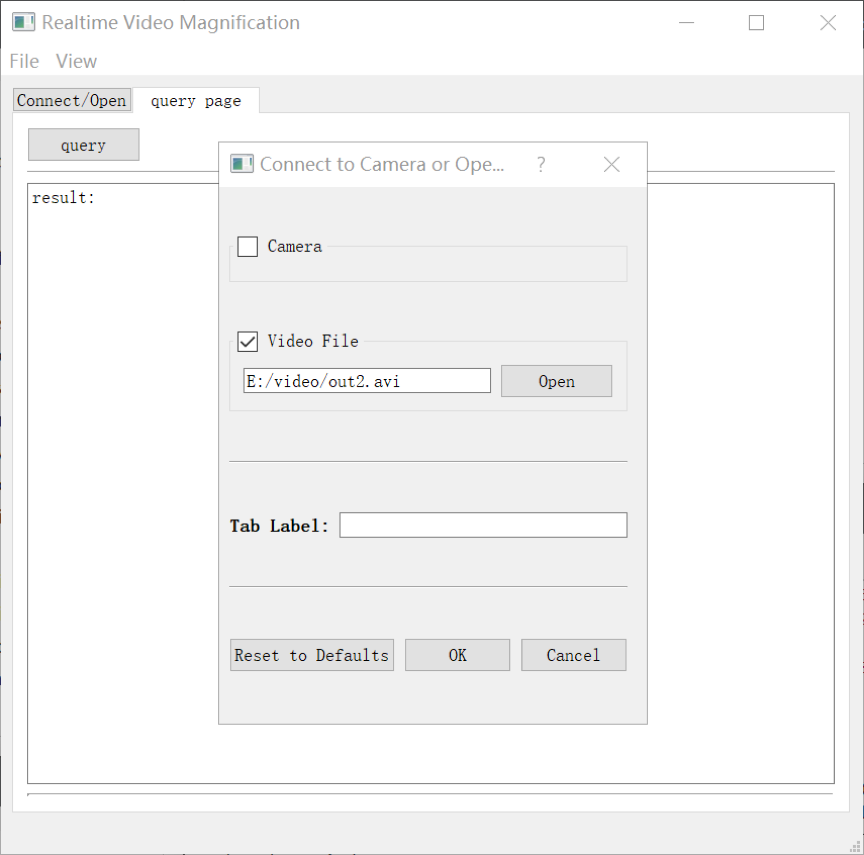

# Realtime-Video-Safety-Helmet-Detection
An OpenCV/Qt based realtime application to magnify motion and color in videos and camerastreams

## Examples

*Image shows the detection output for a video. In the pictures you can see the proposal frames of helmets and people in different colors.

### Dependencies
- [Qt](http://qt-project.org/) >= 5.0
- [OpenCV](http://opencv.org/) >= 2.0 (< 3.0 ? -> not tested yet)
- [CUDA] [CuDnn]
- [MySQL]

# How do I use it?

Operating details refer to 《安全帽检测软件操作说明书》.

### Main Window
When succesfully connected to a camera or opened a window, you can draw a box in the video, to scale and only amplify this Region Of Interest in a video source. Setting the video back to normal can be done via menu that opens with a right click in the video. There is also the option to show the unmagnified image besides the processed one.

### Save
For saving videos or recording from camera you have to specify the file extension by your own. .avi is well supported. If you should encounter problems, please try a differenct saving codec in the toolbar under File->Set Saving Codec.

